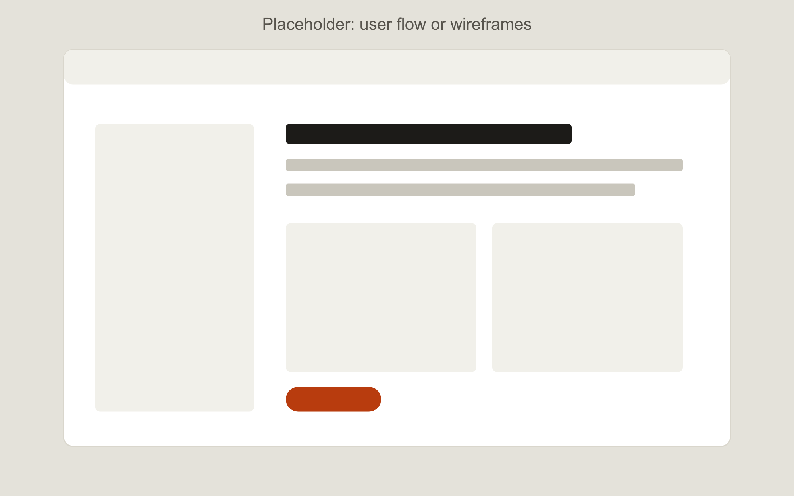
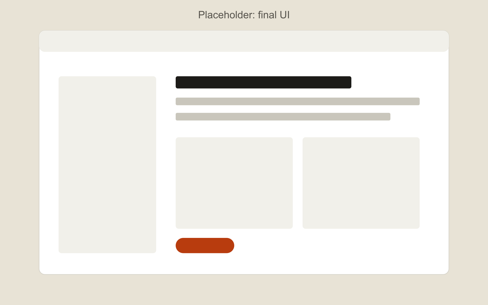

---
# The title is the outcome, not the product name. "Cutting checkout from 7 steps to 3" beats "Shop App Redesign".
title: Sample case study one, the outcome goes in the title
summary: One or two sentences. Who the product is for, what was broken, and what changed after your work.
cover: ./cover.png
coverAlt: Placeholder showing where the case study cover image goes.
order: 1            # 1 shows first on the home page
draft: true        # true hides it on the live site but keeps it in preview
year: "2025"
role: Lead UX designer (solo)
duration: 8 weeks
team: 1 PM, 2 developers
platform: Mobile app
tools: [Figma, FigJam, Maze]
tags: [Research, Interaction design]
tldr:
  problem: What was going wrong for users and for the business, in one or two sentences.
  approach: The two or three things you did that mattered most, for example five interviews, a new information architecture, and two rounds of testing.
  outcome: What changed. A number if you have one; if not, the clearest qualitative result.
metrics:
  - value: "-40%"
    label: time to complete booking
  - value: "5 of 5"
    label: test users finished the task
prototypes:
  # Paste the link from Figma: Present > Share prototype > Copy link. It must be viewable by "Anyone with the link".
  - title: Booking flow, high fidelity
    url: https://www.figma.com/proto/REPLACE-WITH-YOUR-FILE-KEY/Sample
    device: mobile
# figmaFile: https://www.figma.com/design/YOUR-FILE-KEY/Name   (optional link to the full file)
---

## Context

What is the product, who uses it, and why did this project start? Keep it to one short paragraph. A recruiter should understand the situation in ten seconds.

## My role

What you personally did, and who you worked with. If you were the only designer, say so. If it was a course or self-initiated project, say that too; honesty here builds trust.

## Research

What you did to understand the problem: interviews, surveys, competitor review, analytics. Show one artifact, not all of them.

*Caption: one line saying what the image shows and why it matters.*

## Key insight

The one finding that changed the direction of the design. Quote a participant if you can.

> "A short quote from a real user that captures the problem."

## Design decisions

Walk through two or three decisions. For each one: the options you considered, what you picked, and the trade-off you accepted. This is the part hiring managers read most closely.

### Decision 1: name it

Options, choice, trade-off.

### Decision 2: name it

Options, choice, trade-off.

## Testing and iteration

How you tested, what failed, what you changed. One before-and-after is worth a page of text.

*Caption: the final screens after two rounds of testing.*

## Outcome

Results, with numbers where you have them. If the project did not ship, say what you validated and what you would measure.

## What I would do differently

One or two honest lessons. This shows maturity and is often the question interviewers ask first.
