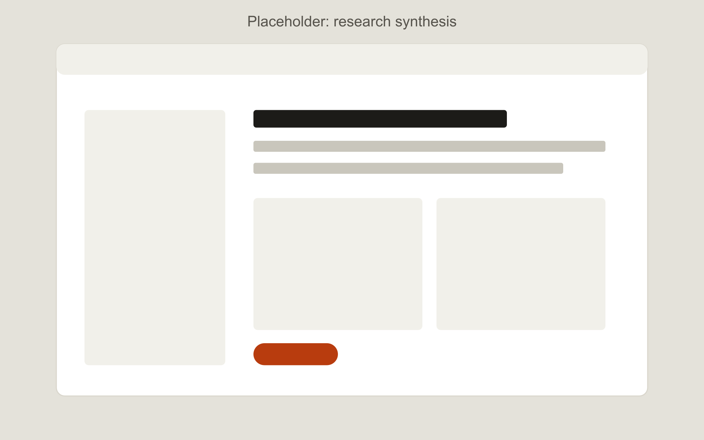

---
title: Sample case study two, a different kind of problem
summary: Use your second case study to show a different skill from the first, for example research depth here and interaction design in the other.
cover: ./cover.png
coverAlt: Placeholder showing where the second case study cover image goes.
order: 2
draft: true
year: "2024"
role: UX designer
duration: 6 weeks
team: Course project, 3 designers
platform: Responsive web
tools: [Figma, Notion]
tags: [UX research, Information architecture]
tldr:
  problem: What was going wrong, in one or two sentences.
  approach: What you did that mattered most.
  outcome: What changed because of it.
metrics: []
prototypes: []
---

## Context

Short paragraph on the product and why the project started.

## My role

What you did personally, and who else was involved.

## Research

*Caption: what this artifact shows.*

## Design decisions

Two or three decisions, each with options, choice and trade-off.

## Outcome

What changed, or what you validated.

## What I would do differently

One honest lesson.
